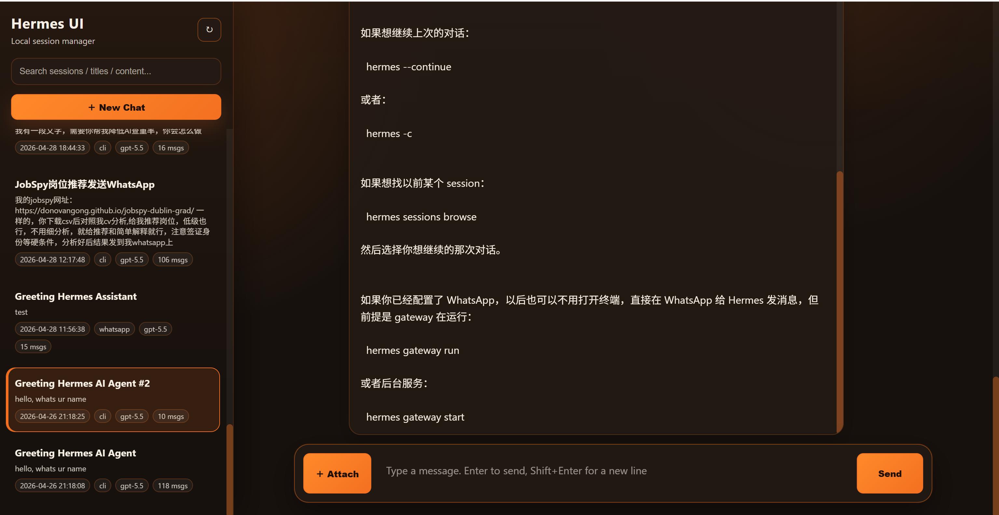

# Hermes Agent Web

A lightweight browser dashboard for Hermes Agent sessions.

It solves a simple problem: terminal sessions are powerful, but browsing, searching, and continuing old conversations from the command line is not always convenient. Hermes Agent Web gives those local sessions a clean web UI without adding a heavy framework.

<p align="center">
  
</p>

## Highlights

- Browse recent Hermes sessions in a sidebar
- Search by title, session ID, model, or message content
- Read conversations in a ChatGPT-style layout
- Continue an existing Hermes session from the browser
- Start a new Hermes session from the browser
- Rename or delete sessions without editing database files manually
- Attach local text/code files when sending a message
- Copy the matching `hermes --resume <session_id>` command
- Automatically jump long message bubbles to the latest content

## Why this exists

Hermes already stores useful session history locally. This project makes that history easier to use:

- no need to remember exact session IDs
- no need to dig through local JSON or SQLite files
- easier to review long conversations
- easier to resume work from the right context
- simple enough to run locally with Python and static frontend files

## Tech stack

- Python standard library HTTP server
- SQLite read access to Hermes state
- Vanilla HTML, CSS, and JavaScript
- GitHub Actions CI for basic syntax, smoke, and sensitive-data checks

## Quick start

```bash
python app.py
```

Then open:

```text
http://127.0.0.1:8765
```
